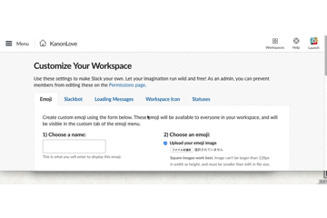

# slack emoji download extension
## デモ(demo)

## インストール（install）

https://github.com/yumechi/slack_emoji_downloader/raw/master/extension_zip/slack_emoji_dl.zip

をダウンロードして解凍したあと、`chrome://extensions/` を開いて、フォルダごとドラッグアンドドロップして入れてください。（zipのままだと失敗します）

You download extension zip file from upper link.
So, you unzip the zip file and open `chrome://extensions/`.
you drop that unziped folder to extensions page.
warning: if you drop zip file, you get failed.

## 説明（README)

Slackのemojiページを開いて(例：https://kanonlove.slack.com/customize/emoji )、"Save all emoji" という追加されているbuttonをクリックすると、全ての絵文字をzipでダウンロードします。

You visit slack custom emoji page(example: https://kanonlove.slack.com/customize/emoji ), and you find out strange "Save all emoji" button.
You click it, you can download your team emoji files on zip.

著作権表記は各種フォルダにLicenseファイル入ってるから問題ないはず？ ← よく見るとpackageの中身はadd gitignoreしない設定だった…
